# EmployeeManager-Elite Database Schema Documentation

This document provides a comprehensive overview of the database schema for the EmployeeManager-Elite backend application. The database is powered by **PostgreSQL** and the schema is managed via Hibernate JPA entities.

## Schema Overview & Design Patterns

### 1. Auditing
Many tables in the system inherit audit fields from `AuditableEntity`. These columns are automatically populated by Spring Data JPA auditing listeners:
* **`created_at`** (`TIMESTAMP`): The date and time when the record was created.
* **`created_by`** (`BIGINT`): The ID of the user who created the record.
* **`updated_at`** (`TIMESTAMP`): The date and time when the record was last updated.
* **`updated_by`** (`BIGINT`): The ID of the user who last updated the record.

### 2. Soft Deletion
Entities that require soft deletion inherit from `AuditSoftDeleteEntity` (which itself extends `AuditableEntity`). This includes:
* **`is_deleted`** (`BOOLEAN`): Indicates whether the record has been soft-deleted (default is `false`).
* **`deleted_at`** (`TIMESTAMP`): The date and time when the record was soft-deleted.
* **`deleted_by`** (`BIGINT`): The ID of the user who soft-deleted the record.
* **`delete_reason`** (`TEXT`/`VARCHAR(255)`): Reason why the record was deleted.

Soft deletion is configured at the Hibernate/JPA level in the child entities using the following annotations:
* **`@SQLDelete`**: Overrides the standard SQL DELETE statement with an UPDATE statement (e.g., `@SQLDelete(sql = "UPDATE <table_name> SET is_deleted = true, deleted_at = NOW() WHERE id = ?")`).
* **`@SQLRestriction`** / **`@Where`**: Appends `is_deleted = false` to all SELECT queries to filter out soft-deleted records.

The following entities implement soft deletion:
* **`Employee`** (table: `employees`)
* **`Project`** (table: `projects`)
* **`Task`** (table: `tasks`)
* **`Team`** (table: `teams`)

### 3. Naming Conventions
* **Tables**: Lowercase plural form with underscore word separators (e.g., `timesheet_entries`, `password_reset_tokens`).
* **Columns**: Lowercase singular form with underscore word separators (e.g., `employee_id`, `requested_by`).
* **Primary Keys**: Typically auto-incrementing `BIGINT` columns named `id` (using identity generator strategy).
* **Foreign Keys**: Suffixed with `_id` and reference the primary key of the parent table.

## Entity Relationship Diagram (ERD)

The following diagram illustrates the primary entities in the system and their relationships:

```mermaid
erDiagram
    attachments {
        BIGINT id PK
        VARCHAR(255) file_name 
        VARCHAR(500) file_path 
        BIGINT file_size_bytes 
        BIGINT uploaded_by FK
        TIMESTAMP uploaded_at 
    }
    audit_logs {
        BIGINT id PK
        BIGINT user_id FK
        VARCHAR(255) action 
        VARCHAR(255) entity_type 
        BIGINT entity_id 
        VARCHAR(255) old_value 
        VARCHAR(255) new_value 
        VARCHAR(255) ip_address 
        VARCHAR(255) user_agent 
        TIMESTAMP timestamp 
    }
    components {
        BIGINT id PK
        VARCHAR(255) component_key 
        VARCHAR(255) component_name 
        VARCHAR(255) route_path 
        VARCHAR(255) icon 
        VARCHAR(255) portal 
        BIGINT parent_component_id FK
        INTEGER display_order 
        BOOLEAN is_active 
        TIMESTAMP created_at 
    }
    role_components {
        BIGINT id PK
        BIGINT role_id FK
        BIGINT component_id FK
        BOOLEAN can_view 
        BOOLEAN can_create 
        BOOLEAN can_edit 
        BOOLEAN can_delete 
        TIMESTAMP created_at 
    }
    role_permissions {
        BIGINT id PK
        BIGINT role_id FK
        BIGINT permission_id FK
    }
    user_roles {
        BIGINT id PK
        BIGINT user_id FK
        BIGINT role_id FK
        BIGINT assigned_by FK
        TIMESTAMP assigned_at 
    }
    password_reset_tokens {
        BIGINT id PK
        BIGINT user_id FK
        VARCHAR(255) token 
        TIMESTAMP expires_at 
        BOOLEAN is_used 
        TIMESTAMP created_at 
    }
    permissions {
        BIGINT id PK
        VARCHAR(255) permission_name 
        VARCHAR(255) description 
    }
    refresh_tokens {
        BIGINT id PK
        BIGINT user_id FK
        VARCHAR(512) token 
        TIMESTAMP expires_at 
        BOOLEAN is_revoked 
        VARCHAR(255) device_info 
        TIMESTAMP created_at 
    }
    roles {
        BIGINT id PK
        VARCHAR(255) role_code 
        VARCHAR(255) name 
        VARCHAR(255) description 
        BOOLEAN is_active 
        TIMESTAMP created_at 
    }
    users {
        BIGINT id PK
        VARCHAR(255) email 
        VARCHAR(255) password_hash 
        VARCHAR(255) raw_password 
        TIMESTAMP password_last_updated_at 
        BOOLEAN is_active 
        TIMESTAMP last_login 
        INTEGER failed_login_attempts 
        TIMESTAMP account_locked_until 
        BOOLEAN force_password_change 
        TIMESTAMP created_at 
        TIMESTAMP updated_at 
    }
    employees {
        TIMESTAMP created_at 
        BIGINT created_by 
        TIMESTAMP updated_at 
        BIGINT updated_by 
        BOOLEAN is_deleted 
        TIMESTAMP deleted_at 
        BIGINT deleted_by 
        VARCHAR(255) delete_reason 
        BIGINT id PK
        VARCHAR(255) employee_code 
        VARCHAR(255) name 
        VARCHAR(255) work_email 
    }
    feed {
        BIGINT id PK
        VARCHAR(255) title 
        VARCHAR(255) content 
        VARCHAR(255) severity 
        BOOLEAN publish_to_internal 
        BOOLEAN publish_to_teams 
        VARCHAR(255) teams_post_status 
        VARCHAR(255) teams_message_id 
        BIGINT created_by FK
        TIMESTAMP created_at 
    }
    links {
        TIMESTAMP created_at 
        BIGINT created_by 
        TIMESTAMP updated_at 
        BIGINT updated_by 
        BIGINT id PK
        VARCHAR(255) filename 
        VARCHAR(255) filelink 
    }
    meetings {
        TIMESTAMP created_at 
        BIGINT created_by 
        TIMESTAMP updated_at 
        BIGINT updated_by 
        BIGINT id PK
        VARCHAR(255) title 
        VARCHAR(255) description 
        VARCHAR(255) meeting_link 
        TIMESTAMP start_time 
        INTEGER duration_minutes 
        BIGINT project_id FK
        BIGINT task_id FK
    }
    projects {
        TIMESTAMP created_at 
        BIGINT created_by 
        TIMESTAMP updated_at 
        BIGINT updated_by 
        BOOLEAN is_deleted 
        TIMESTAMP deleted_at 
        BIGINT deleted_by 
        VARCHAR(255) delete_reason 
        BIGINT id PK
        VARCHAR(255) project_name 
        VARCHAR(255) description 
        VARCHAR(255) client_name 
    }
    project_members {
        BIGINT id PK
        BIGINT project_id FK
        BIGINT employee_id FK
    }
    project_milestones {
        BIGINT id PK
        BIGINT project_id FK
        VARCHAR(255) title 
        DATE due_date 
        VARCHAR(255) status 
        TIMESTAMP completed_at 
    }
    project_teams {
        BIGINT id PK
        BIGINT project_id FK
        BIGINT team_id FK
    }
    eta_extension_requests {
        BIGINT id PK
        BIGINT task_id FK
        BIGINT requested_by FK
        DATE old_eta_date 
        DATE new_eta_date 
        VARCHAR(255) reason 
        VARCHAR(255) status 
        BIGINT reviewed_by FK
        TIMESTAMP reviewed_at 
        VARCHAR(255) rejection_reason 
        TIMESTAMP created_at 
    }
    tasks {
        TIMESTAMP created_at 
        BIGINT created_by 
        TIMESTAMP updated_at 
        BIGINT updated_by 
        BOOLEAN is_deleted 
        TIMESTAMP deleted_at 
        BIGINT deleted_by 
        VARCHAR(255) delete_reason 
        BIGINT id PK
        VARCHAR(255) task_number 
        BIGINT project_id FK
        VARCHAR(255) title 
    }
    task_attachments {
        BIGINT id PK
        BIGINT task_id FK
        VARCHAR(255) file_name 
        VARCHAR(500) file_path 
        BIGINT file_size_bytes 
        BIGINT uploaded_by FK
        TIMESTAMP uploaded_at 
    }
    task_comments {
        BIGINT id PK
        BIGINT task_id FK
        BIGINT author_id FK
        VARCHAR(255) comment_text 
        TIMESTAMP created_at 
    }
    task_draft_batch {
        TIMESTAMP created_at 
        BIGINT created_by 
        TIMESTAMP updated_at 
        BIGINT updated_by 
        BIGINT id PK
        VARCHAR(255) status 
        VARCHAR(255) items_json 
        VARCHAR(255) teams_group_id 
        VARCHAR(255) teams_channel_id 
        TIMESTAMP reminder_sent_at 
    }
    task_progress {
        BIGINT id PK
        BIGINT task_id FK
        BIGINT employee_id FK
        INTEGER progress_percentage 
        VARCHAR(255) notes 
        TIMESTAMP created_at 
    }
    task_status_history {
        BIGINT id PK
        BIGINT task_id FK
        VARCHAR(255) old_status 
        VARCHAR(255) new_status 
        BIGINT changed_by FK
        TIMESTAMP changed_at 
        VARCHAR(255) reason 
    }
    task_tags {
        BIGINT id PK
        VARCHAR(255) tag_name 
        TIMESTAMP created_at 
    }
    task_tag_mapping {
        BIGINT id PK
        BIGINT task_id FK
        BIGINT tag_id FK
    }
    task_transfer {
        BIGINT id PK
        BIGINT task_id FK
        BIGINT requested_by FK
        BIGINT target_employee_id FK
        VARCHAR(255) reason 
        VARCHAR(255) status 
        BIGINT reviewed_by FK
        TIMESTAMP reviewed_at 
        VARCHAR(255) rejection_reason 
        TIMESTAMP created_at 
    }
    teams {
        TIMESTAMP created_at 
        BIGINT created_by 
        TIMESTAMP updated_at 
        BIGINT updated_by 
        BOOLEAN is_deleted 
        TIMESTAMP deleted_at 
        BIGINT deleted_by 
        VARCHAR(255) delete_reason 
        BIGINT id PK
        VARCHAR(255) team_name 
        VARCHAR(255) description 
        BIGINT lead_id FK
    }
    team_members {
        BIGINT id PK
        BIGINT team_id FK
        BIGINT employee_id FK
        TIMESTAMP joined_at 
    }
    timesheet_entries {
        BIGINT id PK
        BIGINT employee_id FK
        BIGINT task_id FK
        BIGINT project_id FK
        VARCHAR(255) bug_number 
        VARCHAR(255) work_category 
        DATE work_date 
        TIMESTAMP start_time 
        TIMESTAMP end_time 
        NUMERIC hours_spent 
        VARCHAR(255) description 
        VARCHAR(255) status 
    }
    components ||--o{ components : "parent_component_id"
    components ||--o{ role_components : "component_id"
    employees ||--o{ attachments : "uploaded_by"
    employees ||--o{ eta_extension_requests : "requested_by"
    employees ||--o{ feed : "created_by"
    employees ||--o{ project_members : "employee_id"
    employees ||--o{ task_attachments : "uploaded_by"
    employees ||--o{ task_comments : "author_id"
    employees ||--o{ task_progress : "employee_id"
    employees ||--o{ task_transfer : "requested_by"
    employees ||--o{ task_transfer : "target_employee_id"
    employees ||--o{ tasks : "assigned_to"
    employees ||--o{ team_members : "employee_id"
    employees ||--o{ teams : "lead_id"
    employees ||--o{ teams : "sub_lead_id"
    employees ||--o{ timesheet_entries : "approved_by"
    employees ||--o{ timesheet_entries : "employee_id"
    permissions ||--o{ role_permissions : "permission_id"
    projects ||--o{ meetings : "project_id"
    projects ||--o{ project_members : "project_id"
    projects ||--o{ project_milestones : "project_id"
    projects ||--o{ project_teams : "project_id"
    projects ||--o{ tasks : "project_id"
    projects ||--o{ timesheet_entries : "project_id"
    roles ||--o{ role_components : "role_id"
    roles ||--o{ role_permissions : "role_id"
    roles ||--o{ user_roles : "role_id"
    task_tags ||--o{ task_tag_mapping : "tag_id"
    tasks ||--o{ eta_extension_requests : "task_id"
    tasks ||--o{ meetings : "task_id"
    tasks ||--o{ task_attachments : "task_id"
    tasks ||--o{ task_comments : "task_id"
    tasks ||--o{ task_progress : "task_id"
    tasks ||--o{ task_status_history : "task_id"
    tasks ||--o{ task_tag_mapping : "task_id"
    tasks ||--o{ task_transfer : "task_id"
    tasks ||--o{ timesheet_entries : "task_id"
    teams ||--o{ project_teams : "team_id"
    teams ||--o{ team_members : "team_id"
    users ||--o{ audit_logs : "user_id"
    users ||--o{ employees : "user_id"
    users ||--o{ eta_extension_requests : "reviewed_by"
    users ||--o{ password_reset_tokens : "user_id"
    users ||--o{ refresh_tokens : "user_id"
    users ||--o{ task_status_history : "changed_by"
    users ||--o{ task_transfer : "reviewed_by"
    users ||--o{ user_roles : "assigned_by"
    users ||--o{ user_roles : "user_id"
```

## Database Tables by Module

### Attachment Module

#### Table: `attachments` (Entity: `Attachment`)

**Description**: Stores records for attachments.

| Column | SQL Type | Nullable | Constraints | References / Description |
|---|---|---|---|---|
| **`id` (PK)** | `BIGINT` | No | - | - |
| `file_name` | `VARCHAR(255)` | No | NOT NULL | - |
| `file_path` | `VARCHAR(500)` | No | NOT NULL, VARCHAR(500) | - |
| `file_size_bytes` | `BIGINT` | No | NOT NULL | - |
| `uploaded_by` | `BIGINT` | No | NOT NULL | FK -> `employees`.id |
| `uploaded_at` | `TIMESTAMP` | No | NOT NULL | - |

**Relationships**:
- **ManyToOne**: `uploaded_by` foreign key referencing `employees`.id

---

### Auditsoftdelete Module

#### Table: `audit_logs` (Entity: `AuditLog`)

**Description**: Stores records for audit logs.

| Column | SQL Type | Nullable | Constraints | References / Description |
|---|---|---|---|---|
| **`id` (PK)** | `BIGINT` | No | - | - |
| `user_id` | `BIGINT` | No | NOT NULL | FK -> `users`.id |
| `action` | `VARCHAR(255)` | No | NOT NULL | - |
| `entity_type` | `VARCHAR(255)` | No | NOT NULL | - |
| `entity_id` | `BIGINT` | No | NOT NULL | - |
| `old_value` | `VARCHAR(255)` | Yes | - | - |
| `new_value` | `VARCHAR(255)` | Yes | - | - |
| `ip_address` | `VARCHAR(255)` | Yes | - | - |
| `user_agent` | `VARCHAR(255)` | Yes | - | - |
| `timestamp` | `TIMESTAMP` | No | NOT NULL | - |

**Relationships**:
- **ManyToOne**: `user_id` foreign key referencing `users`.id

---

### Auth Module

#### Table: `components` (Entity: `Component`)

**Description**: Stores records for components.

| Column | SQL Type | Nullable | Constraints | References / Description |
|---|---|---|---|---|
| **`id` (PK)** | `BIGINT` | No | - | - |
| `component_key` | `VARCHAR(255)` | No | NOT NULL, UNIQUE | - |
| `component_name` | `VARCHAR(255)` | No | NOT NULL | - |
| `route_path` | `VARCHAR(255)` | No | NOT NULL | - |
| `icon` | `VARCHAR(255)` | Yes | - | - |
| `portal` | `VARCHAR(255)` | No | NOT NULL | - |
| `parent_component_id` | `BIGINT` | Yes | - | FK -> `components`.id |
| `display_order` | `INTEGER` | No | NOT NULL | - |
| `is_active` | `BOOLEAN` | No | NOT NULL | - |
| `created_at` | `TIMESTAMP` | No | NOT NULL | Audit field (AuditableEntity) |

**Relationships**:
- **ManyToOne**: `parent_component_id` foreign key referencing `components`.id

---

#### Table: `password_reset_tokens` (Entity: `PasswordResetToken`)

**Description**: Stores records for password reset tokens.

| Column | SQL Type | Nullable | Constraints | References / Description |
|---|---|---|---|---|
| **`id` (PK)** | `BIGINT` | No | - | - |
| `user_id` | `BIGINT` | No | NOT NULL | FK -> `users`.id |
| `token` | `VARCHAR(255)` | No | NOT NULL, UNIQUE | - |
| `expires_at` | `TIMESTAMP` | No | NOT NULL | - |
| `is_used` | `BOOLEAN` | No | NOT NULL | - |
| `created_at` | `TIMESTAMP` | No | NOT NULL | Audit field (AuditableEntity) |

**Relationships**:
- **ManyToOne**: `user_id` foreign key referencing `users`.id

---

#### Table: `permissions` (Entity: `Permission`)

**Description**: Stores records for permissions.

| Column | SQL Type | Nullable | Constraints | References / Description |
|---|---|---|---|---|
| **`id` (PK)** | `BIGINT` | No | - | - |
| `permission_name` | `VARCHAR(255)` | No | NOT NULL, UNIQUE | - |
| `description` | `VARCHAR(255)` | Yes | - | - |

---

#### Table: `refresh_tokens` (Entity: `RefreshToken`)

**Description**: Stores records for refresh tokens.

| Column | SQL Type | Nullable | Constraints | References / Description |
|---|---|---|---|---|
| **`id` (PK)** | `BIGINT` | No | - | - |
| `user_id` | `BIGINT` | No | NOT NULL | FK -> `users`.id |
| `token` | `VARCHAR(512)` | No | NOT NULL, UNIQUE, VARCHAR(512) | - |
| `expires_at` | `TIMESTAMP` | No | NOT NULL | - |
| `is_revoked` | `BOOLEAN` | No | NOT NULL | - |
| `device_info` | `VARCHAR(255)` | Yes | - | - |
| `created_at` | `TIMESTAMP` | No | NOT NULL | Audit field (AuditableEntity) |

**Relationships**:
- **ManyToOne**: `user_id` foreign key referencing `users`.id

---

#### Table: `role_components` (Entity: `RoleComponent`)

**Description**: Stores records for role components.

| Column | SQL Type | Nullable | Constraints | References / Description |
|---|---|---|---|---|
| **`id` (PK)** | `BIGINT` | No | - | - |
| `role_id` | `BIGINT` | No | NOT NULL | FK -> `roles`.id |
| `component_id` | `BIGINT` | No | NOT NULL | FK -> `components`.id |
| `can_view` | `BOOLEAN` | No | NOT NULL | - |
| `can_create` | `BOOLEAN` | No | NOT NULL | - |
| `can_edit` | `BOOLEAN` | No | NOT NULL | - |
| `can_delete` | `BOOLEAN` | No | NOT NULL | - |
| `created_at` | `TIMESTAMP` | No | NOT NULL | Audit field (AuditableEntity) |

**Relationships**:
- **ManyToOne**: `role_id` foreign key referencing `roles`.id
- **ManyToOne**: `component_id` foreign key referencing `components`.id

---

#### Table: `role_permissions` (Entity: `RolePermission`)

**Description**: Stores records for role permissions.

| Column | SQL Type | Nullable | Constraints | References / Description |
|---|---|---|---|---|
| **`id` (PK)** | `BIGINT` | No | - | - |
| `role_id` | `BIGINT` | No | NOT NULL | FK -> `roles`.id |
| `permission_id` | `BIGINT` | No | NOT NULL | FK -> `permissions`.id |

**Relationships**:
- **ManyToOne**: `role_id` foreign key referencing `roles`.id
- **ManyToOne**: `permission_id` foreign key referencing `permissions`.id

---

#### Table: `roles` (Entity: `Role`)

**Description**: Stores records for roles.

| Column | SQL Type | Nullable | Constraints | References / Description |
|---|---|---|---|---|
| **`id` (PK)** | `BIGINT` | No | - | - |
| `role_code` | `VARCHAR(255)` | No | NOT NULL, UNIQUE | - |
| `name` | `VARCHAR(255)` | No | NOT NULL | - |
| `description` | `VARCHAR(255)` | Yes | - | - |
| `is_active` | `BOOLEAN` | No | NOT NULL | - |
| `created_at` | `TIMESTAMP` | No | NOT NULL | Audit field (AuditableEntity) |

---

#### Table: `user_roles` (Entity: `UserRole`)

**Description**: Stores records for user roles.

| Column | SQL Type | Nullable | Constraints | References / Description |
|---|---|---|---|---|
| **`id` (PK)** | `BIGINT` | No | - | - |
| `user_id` | `BIGINT` | No | NOT NULL | FK -> `users`.id |
| `role_id` | `BIGINT` | No | NOT NULL | FK -> `roles`.id |
| `assigned_by` | `BIGINT` | Yes | - | FK -> `users`.id |
| `assigned_at` | `TIMESTAMP` | No | NOT NULL | - |

**Relationships**:
- **ManyToOne**: `user_id` foreign key referencing `users`.id
- **ManyToOne**: `role_id` foreign key referencing `roles`.id
- **ManyToOne**: `assigned_by` foreign key referencing `users`.id

---

#### Table: `users` (Entity: `User`)

**Description**: Stores authentication users containing username, email, password, and status.

| Column | SQL Type | Nullable | Constraints | References / Description |
|---|---|---|---|---|
| **`id` (PK)** | `BIGINT` | No | - | - |
| `email` | `VARCHAR(255)` | No | NOT NULL | - |
| `password_hash` | `VARCHAR(255)` | No | NOT NULL | - |
| `raw_password` | `VARCHAR(255)` | Yes | - | - |
| `password_last_updated_at` | `TIMESTAMP` | No | NOT NULL | - |
| `is_active` | `BOOLEAN` | No | NOT NULL | - |
| `last_login` | `TIMESTAMP` | Yes | - | - |
| `failed_login_attempts` | `INTEGER` | No | NOT NULL | - |
| `account_locked_until` | `TIMESTAMP` | Yes | - | - |
| `force_password_change` | `BOOLEAN` | No | NOT NULL | - |
| `created_at` | `TIMESTAMP` | No | NOT NULL | Audit field (AuditableEntity) |
| `updated_at` | `TIMESTAMP` | No | NOT NULL | Audit field (AuditableEntity) |
| `authorities` | `COLLECTION` | Yes | - | - |

---

### Employee Module

#### Table: `employees` (Entity: `Employee`)

**Description**: Stores employee profiles containing personal details, contact info, job details, and status. Corresponds to a User account.

| Column | SQL Type | Nullable | Constraints | References / Description |
|---|---|---|---|---|
| `created_at` | `TIMESTAMP` | No | NOT NULL | Audit field (AuditableEntity) |
| `created_by` | `BIGINT` | Yes | - | Audit field (AuditableEntity) |
| `updated_at` | `TIMESTAMP` | No | NOT NULL | Audit field (AuditableEntity) |
| `updated_by` | `BIGINT` | Yes | - | Audit field (AuditableEntity) |
| `is_deleted` | `BOOLEAN` | No | NOT NULL | Soft delete field (AuditSoftDeleteEntity) |
| `deleted_at` | `TIMESTAMP` | Yes | - | Soft delete field (AuditSoftDeleteEntity) |
| `deleted_by` | `BIGINT` | Yes | - | Soft delete field (AuditSoftDeleteEntity) |
| `delete_reason` | `VARCHAR(255)` | Yes | - | Soft delete field (AuditSoftDeleteEntity) |
| **`id` (PK)** | `BIGINT` | No | - | - |
| `employee_code` | `VARCHAR(255)` | No | NOT NULL | - |
| `name` | `VARCHAR(255)` | No | NOT NULL | - |
| `work_email` | `VARCHAR(255)` | No | NOT NULL | - |
| `personal_email` | `VARCHAR(255)` | Yes | - | - |
| `phone` | `VARCHAR(255)` | No | NOT NULL | - |
| `designation` | `VARCHAR(255)` | No | NOT NULL | - |
| `roles` | `COLLECTION` | Yes | - | - |
| `user_id` | `BIGINT` | No | NOT NULL | FK -> `users`.id |
| `joining_date` | `DATE` | No | NOT NULL | - |
| `status` | `VARCHAR(255)` | No | NOT NULL | - |
| `notification_preference` | `VARCHAR(255)` | No | NOT NULL | - |
| `profile_image` | `VARCHAR(255)` | Yes | - | - |

**Relationships**:
- **ManyToOne**: `user_id` foreign key referencing `users`.id

---

### Feed Module

#### Table: `feed` (Entity: `Feed`)

**Description**: Stores records for feed.

| Column | SQL Type | Nullable | Constraints | References / Description |
|---|---|---|---|---|
| **`id` (PK)** | `BIGINT` | No | - | - |
| `title` | `VARCHAR(255)` | No | NOT NULL | - |
| `content` | `VARCHAR(255)` | No | NOT NULL | - |
| `severity` | `VARCHAR(255)` | No | NOT NULL | - |
| `publish_to_internal` | `BOOLEAN` | No | NOT NULL | - |
| `publish_to_teams` | `BOOLEAN` | No | NOT NULL | - |
| `teams_post_status` | `VARCHAR(255)` | Yes | - | - |
| `teams_message_id` | `VARCHAR(255)` | Yes | - | - |
| `created_by` | `BIGINT` | No | NOT NULL | FK -> `employees`.id |
| `created_at` | `TIMESTAMP` | No | NOT NULL | Audit field (AuditableEntity) |

**Relationships**:
- **ManyToOne**: `created_by` foreign key referencing `employees`.id

---

### Link Module

#### Table: `links` (Entity: `Link`)

**Description**: Stores records for links.

| Column | SQL Type | Nullable | Constraints | References / Description |
|---|---|---|---|---|
| `created_at` | `TIMESTAMP` | No | NOT NULL | Audit field (AuditableEntity) |
| `created_by` | `BIGINT` | Yes | - | Audit field (AuditableEntity) |
| `updated_at` | `TIMESTAMP` | No | NOT NULL | Audit field (AuditableEntity) |
| `updated_by` | `BIGINT` | Yes | - | Audit field (AuditableEntity) |
| **`id` (PK)** | `BIGINT` | No | - | - |
| `filename` | `VARCHAR(255)` | No | NOT NULL | - |
| `filelink` | `VARCHAR(255)` | No | NOT NULL | - |

---

### Meeting Module

#### Table: `meetings` (Entity: `Meeting`)

**Description**: Stores records for meetings.

| Column | SQL Type | Nullable | Constraints | References / Description |
|---|---|---|---|---|
| `created_at` | `TIMESTAMP` | No | NOT NULL | Audit field (AuditableEntity) |
| `created_by` | `BIGINT` | Yes | - | Audit field (AuditableEntity) |
| `updated_at` | `TIMESTAMP` | No | NOT NULL | Audit field (AuditableEntity) |
| `updated_by` | `BIGINT` | Yes | - | Audit field (AuditableEntity) |
| **`id` (PK)** | `BIGINT` | No | - | - |
| `title` | `VARCHAR(255)` | No | NOT NULL | - |
| `description` | `VARCHAR(255)` | Yes | - | - |
| `meeting_link` | `VARCHAR(255)` | No | NOT NULL | - |
| `start_time` | `TIMESTAMP` | No | NOT NULL | - |
| `duration_minutes` | `INTEGER` | No | NOT NULL | - |
| `project_id` | `BIGINT` | Yes | - | FK -> `projects`.id |
| `task_id` | `BIGINT` | Yes | - | FK -> `tasks`.id |
| `meeting_attendees` | `COLLECTION` | Yes | - | - |

**Relationships**:
- **ManyToOne**: `project_id` foreign key referencing `projects`.id
- **ManyToOne**: `task_id` foreign key referencing `tasks`.id
- **ManyToMany**: Managed via relationship table targeting `employees`

---

### Project Module

#### Table: `project_members` (Entity: `ProjectEmployee`)

**Description**: Mapping table representing employee membership in projects, with billing details and roles.

| Column | SQL Type | Nullable | Constraints | References / Description |
|---|---|---|---|---|
| **`id` (PK)** | `BIGINT` | No | - | - |
| `project_id` | `BIGINT` | No | NOT NULL | FK -> `projects`.id |
| `employee_id` | `BIGINT` | No | NOT NULL | FK -> `employees`.id |

**Relationships**:
- **ManyToOne**: `project_id` foreign key referencing `projects`.id
- **ManyToOne**: `employee_id` foreign key referencing `employees`.id

---

#### Table: `project_milestones` (Entity: `ProjectMilestone`)

**Description**: Stores records for project milestones.

| Column | SQL Type | Nullable | Constraints | References / Description |
|---|---|---|---|---|
| **`id` (PK)** | `BIGINT` | No | - | - |
| `project_id` | `BIGINT` | No | NOT NULL | FK -> `projects`.id |
| `title` | `VARCHAR(255)` | No | NOT NULL | - |
| `due_date` | `DATE` | No | NOT NULL | - |
| `status` | `VARCHAR(255)` | No | NOT NULL | - |
| `completed_at` | `TIMESTAMP` | Yes | - | - |

**Relationships**:
- **ManyToOne**: `project_id` foreign key referencing `projects`.id

---

#### Table: `project_teams` (Entity: `ProjectTeam`)

**Description**: Stores records for project teams.

| Column | SQL Type | Nullable | Constraints | References / Description |
|---|---|---|---|---|
| **`id` (PK)** | `BIGINT` | No | - | - |
| `project_id` | `BIGINT` | No | NOT NULL | FK -> `projects`.id |
| `team_id` | `BIGINT` | No | NOT NULL | FK -> `teams`.id |

**Relationships**:
- **ManyToOne**: `project_id` foreign key referencing `projects`.id
- **ManyToOne**: `team_id` foreign key referencing `teams`.id

---

#### Table: `projects` (Entity: `Project`)

**Description**: Stores projects undertaken by the organization, including client info, dates, and budget details.

| Column | SQL Type | Nullable | Constraints | References / Description |
|---|---|---|---|---|
| `created_at` | `TIMESTAMP` | No | NOT NULL | Audit field (AuditableEntity) |
| `created_by` | `BIGINT` | Yes | - | Audit field (AuditableEntity) |
| `updated_at` | `TIMESTAMP` | No | NOT NULL | Audit field (AuditableEntity) |
| `updated_by` | `BIGINT` | Yes | - | Audit field (AuditableEntity) |
| `is_deleted` | `BOOLEAN` | No | NOT NULL | Soft delete field (AuditSoftDeleteEntity) |
| `deleted_at` | `TIMESTAMP` | Yes | - | Soft delete field (AuditSoftDeleteEntity) |
| `deleted_by` | `BIGINT` | Yes | - | Soft delete field (AuditSoftDeleteEntity) |
| `delete_reason` | `VARCHAR(255)` | Yes | - | Soft delete field (AuditSoftDeleteEntity) |
| **`id` (PK)** | `BIGINT` | No | - | - |
| `project_name` | `VARCHAR(255)` | No | NOT NULL | - |
| `description` | `VARCHAR(255)` | Yes | - | - |
| `client_name` | `VARCHAR(255)` | No | NOT NULL | - |
| `color_hex` | `VARCHAR(7)` | No | NOT NULL, VARCHAR(7) | - |
| `start_date` | `DATE` | No | NOT NULL | - |
| `end_date` | `DATE` | Yes | - | - |
| `status` | `VARCHAR(255)` | No | NOT NULL | - |
| `progress_percentage` | `INTEGER` | No | NOT NULL | - |

---

### Task Module

#### Table: `eta_extension_requests` (Entity: `EtaExtension`)

**Description**: Stores records for eta extension requests.

| Column | SQL Type | Nullable | Constraints | References / Description |
|---|---|---|---|---|
| **`id` (PK)** | `BIGINT` | No | - | - |
| `task_id` | `BIGINT` | No | NOT NULL | FK -> `tasks`.id |
| `requested_by` | `BIGINT` | No | NOT NULL | FK -> `employees`.id |
| `old_eta_date` | `DATE` | No | NOT NULL | - |
| `new_eta_date` | `DATE` | No | NOT NULL | - |
| `reason` | `VARCHAR(255)` | No | NOT NULL | - |
| `status` | `VARCHAR(255)` | No | NOT NULL | - |
| `reviewed_by` | `BIGINT` | Yes | - | FK -> `users`.id |
| `reviewed_at` | `TIMESTAMP` | Yes | - | - |
| `rejection_reason` | `VARCHAR(255)` | Yes | - | - |
| `created_at` | `TIMESTAMP` | No | NOT NULL | Audit field (AuditableEntity) |

**Relationships**:
- **ManyToOne**: `task_id` foreign key referencing `tasks`.id
- **ManyToOne**: `requested_by` foreign key referencing `employees`.id
- **ManyToOne**: `reviewed_by` foreign key referencing `users`.id

---

#### Table: `task_attachments` (Entity: `TaskAttachment`)

**Description**: Stores records for task attachments.

| Column | SQL Type | Nullable | Constraints | References / Description |
|---|---|---|---|---|
| **`id` (PK)** | `BIGINT` | No | - | - |
| `task_id` | `BIGINT` | No | NOT NULL | FK -> `tasks`.id |
| `file_name` | `VARCHAR(255)` | No | NOT NULL | - |
| `file_path` | `VARCHAR(500)` | No | NOT NULL, VARCHAR(500) | - |
| `file_size_bytes` | `BIGINT` | No | NOT NULL | - |
| `uploaded_by` | `BIGINT` | No | NOT NULL | FK -> `employees`.id |
| `uploaded_at` | `TIMESTAMP` | No | NOT NULL | - |

**Relationships**:
- **ManyToOne**: `task_id` foreign key referencing `tasks`.id
- **ManyToOne**: `uploaded_by` foreign key referencing `employees`.id

---

#### Table: `task_comments` (Entity: `TaskComment`)

**Description**: Stores records for task comments.

| Column | SQL Type | Nullable | Constraints | References / Description |
|---|---|---|---|---|
| **`id` (PK)** | `BIGINT` | No | - | - |
| `task_id` | `BIGINT` | No | NOT NULL | FK -> `tasks`.id |
| `author_id` | `BIGINT` | No | NOT NULL | FK -> `employees`.id |
| `comment_text` | `VARCHAR(255)` | No | NOT NULL | - |
| `created_at` | `TIMESTAMP` | No | NOT NULL | Audit field (AuditableEntity) |

**Relationships**:
- **ManyToOne**: `task_id` foreign key referencing `tasks`.id
- **ManyToOne**: `author_id` foreign key referencing `employees`.id

---

#### Table: `task_draft_batch` (Entity: `TaskDraftBatch`)

**Description**: Stores records for task draft batch.

| Column | SQL Type | Nullable | Constraints | References / Description |
|---|---|---|---|---|
| `created_at` | `TIMESTAMP` | No | NOT NULL | Audit field (AuditableEntity) |
| `created_by` | `BIGINT` | Yes | - | Audit field (AuditableEntity) |
| `updated_at` | `TIMESTAMP` | No | NOT NULL | Audit field (AuditableEntity) |
| `updated_by` | `BIGINT` | Yes | - | Audit field (AuditableEntity) |
| **`id` (PK)** | `BIGINT` | No | - | - |
| `status` | `VARCHAR(255)` | No | NOT NULL | - |
| `items_json` | `VARCHAR(255)` | No | NOT NULL | - |
| `teams_group_id` | `VARCHAR(255)` | Yes | - | - |
| `teams_channel_id` | `VARCHAR(255)` | Yes | - | - |
| `reminder_sent_at` | `TIMESTAMP` | Yes | - | - |

---

#### Table: `task_progress` (Entity: `TaskProgress`)

**Description**: Stores records for task progress.

| Column | SQL Type | Nullable | Constraints | References / Description |
|---|---|---|---|---|
| **`id` (PK)** | `BIGINT` | No | - | - |
| `task_id` | `BIGINT` | No | NOT NULL | FK -> `tasks`.id |
| `employee_id` | `BIGINT` | No | NOT NULL | FK -> `employees`.id |
| `progress_percentage` | `INTEGER` | No | NOT NULL | - |
| `notes` | `VARCHAR(255)` | Yes | - | - |
| `created_at` | `TIMESTAMP` | No | NOT NULL | Audit field (AuditableEntity) |

**Relationships**:
- **ManyToOne**: `task_id` foreign key referencing `tasks`.id
- **ManyToOne**: `employee_id` foreign key referencing `employees`.id

---

#### Table: `task_status_history` (Entity: `TaskStatusHistory`)

**Description**: Stores records for task status history.

| Column | SQL Type | Nullable | Constraints | References / Description |
|---|---|---|---|---|
| **`id` (PK)** | `BIGINT` | No | - | - |
| `task_id` | `BIGINT` | No | NOT NULL | FK -> `tasks`.id |
| `old_status` | `VARCHAR(255)` | No | NOT NULL | - |
| `new_status` | `VARCHAR(255)` | No | NOT NULL | - |
| `changed_by` | `BIGINT` | Yes | - | FK -> `users`.id |
| `changed_at` | `TIMESTAMP` | No | NOT NULL | - |
| `reason` | `VARCHAR(255)` | Yes | - | - |

**Relationships**:
- **ManyToOne**: `task_id` foreign key referencing `tasks`.id
- **ManyToOne**: `changed_by` foreign key referencing `users`.id

---

#### Table: `task_tag_mapping` (Entity: `TaskTagMapping`)

**Description**: Stores records for task tag mapping.

| Column | SQL Type | Nullable | Constraints | References / Description |
|---|---|---|---|---|
| **`id` (PK)** | `BIGINT` | No | - | - |
| `task_id` | `BIGINT` | No | NOT NULL | FK -> `tasks`.id |
| `tag_id` | `BIGINT` | No | NOT NULL | FK -> `task_tags`.id |

**Relationships**:
- **ManyToOne**: `task_id` foreign key referencing `tasks`.id
- **ManyToOne**: `tag_id` foreign key referencing `task_tags`.id

---

#### Table: `task_tags` (Entity: `TaskTag`)

**Description**: Stores records for task tags.

| Column | SQL Type | Nullable | Constraints | References / Description |
|---|---|---|---|---|
| **`id` (PK)** | `BIGINT` | No | - | - |
| `tag_name` | `VARCHAR(255)` | No | NOT NULL, UNIQUE | - |
| `created_at` | `TIMESTAMP` | No | NOT NULL | Audit field (AuditableEntity) |

---

#### Table: `task_transfer` (Entity: `TaskTransfer`)

**Description**: Stores records for task transfer.

| Column | SQL Type | Nullable | Constraints | References / Description |
|---|---|---|---|---|
| **`id` (PK)** | `BIGINT` | No | - | - |
| `task_id` | `BIGINT` | No | NOT NULL | FK -> `tasks`.id |
| `requested_by` | `BIGINT` | No | NOT NULL | FK -> `employees`.id |
| `target_employee_id` | `BIGINT` | No | NOT NULL | FK -> `employees`.id |
| `reason` | `VARCHAR(255)` | No | NOT NULL | - |
| `status` | `VARCHAR(255)` | No | NOT NULL | - |
| `reviewed_by` | `BIGINT` | Yes | - | FK -> `users`.id |
| `reviewed_at` | `TIMESTAMP` | Yes | - | - |
| `rejection_reason` | `VARCHAR(255)` | Yes | - | - |
| `created_at` | `TIMESTAMP` | No | NOT NULL | Audit field (AuditableEntity) |

**Relationships**:
- **ManyToOne**: `task_id` foreign key referencing `tasks`.id
- **ManyToOne**: `requested_by` foreign key referencing `employees`.id
- **ManyToOne**: `target_employee_id` foreign key referencing `employees`.id
- **ManyToOne**: `reviewed_by` foreign key referencing `users`.id

---

#### Table: `tasks` (Entity: `Task`)

**Description**: Stores task items assigned to employees within projects, including status, priority, and deadlines.

| Column | SQL Type | Nullable | Constraints | References / Description |
|---|---|---|---|---|
| `created_at` | `TIMESTAMP` | No | NOT NULL | Audit field (AuditableEntity) |
| `created_by` | `BIGINT` | Yes | - | Audit field (AuditableEntity) |
| `updated_at` | `TIMESTAMP` | No | NOT NULL | Audit field (AuditableEntity) |
| `updated_by` | `BIGINT` | Yes | - | Audit field (AuditableEntity) |
| `is_deleted` | `BOOLEAN` | No | NOT NULL | Soft delete field (AuditSoftDeleteEntity) |
| `deleted_at` | `TIMESTAMP` | Yes | - | Soft delete field (AuditSoftDeleteEntity) |
| `deleted_by` | `BIGINT` | Yes | - | Soft delete field (AuditSoftDeleteEntity) |
| `delete_reason` | `VARCHAR(255)` | Yes | - | Soft delete field (AuditSoftDeleteEntity) |
| **`id` (PK)** | `BIGINT` | No | - | - |
| `task_number` | `VARCHAR(255)` | No | NOT NULL | - |
| `project_id` | `BIGINT` | No | NOT NULL | FK -> `projects`.id |
| `title` | `VARCHAR(255)` | No | NOT NULL | - |
| `description` | `VARCHAR(255)` | Yes | - | - |
| `task_type` | `VARCHAR(255)` | No | NOT NULL | - |
| `priority` | `VARCHAR(255)` | No | NOT NULL | - |
| `status` | `VARCHAR(255)` | No | NOT NULL | - |
| `eta_hours` | `NUMERIC` | No | NOT NULL | - |
| `eta_date` | `DATE` | No | NOT NULL | - |
| `original_eta_date` | `DATE` | No | NOT NULL | - |
| `extended_eta_date` | `DATE` | Yes | - | - |
| `bug_number` | `VARCHAR(255)` | Yes | - | - |
| `assigned_to` | `BIGINT` | Yes | - | FK -> `employees`.id |
| `epic` | `VARCHAR(255)` | Yes | - | - |
| `justification` | `VARCHAR(255)` | Yes | - | - |
| `completion_review_status` | `VARCHAR(255)` | Yes | - | - |
| `review_comment` | `VARCHAR(255)` | Yes | - | - |
| `logged_hours` | `NUMERIC` | Yes | - | - |

**Relationships**:
- **ManyToOne**: `project_id` foreign key referencing `projects`.id
- **ManyToOne**: `assigned_to` foreign key referencing `employees`.id

---

### Team Module

#### Table: `team_members` (Entity: `TeamEmployee`)

**Description**: Mapping table representing employee membership in teams, with roles and allocations.

| Column | SQL Type | Nullable | Constraints | References / Description |
|---|---|---|---|---|
| **`id` (PK)** | `BIGINT` | No | - | - |
| `team_id` | `BIGINT` | No | NOT NULL | FK -> `teams`.id |
| `employee_id` | `BIGINT` | No | NOT NULL | FK -> `employees`.id |
| `joined_at` | `TIMESTAMP` | No | NOT NULL | - |

**Relationships**:
- **ManyToOne**: `team_id` foreign key referencing `teams`.id
- **ManyToOne**: `employee_id` foreign key referencing `employees`.id

---

#### Table: `teams` (Entity: `Team`)

**Description**: Stores departments/teams within the organization.

| Column | SQL Type | Nullable | Constraints | References / Description |
|---|---|---|---|---|
| `created_at` | `TIMESTAMP` | No | NOT NULL | Audit field (AuditableEntity) |
| `created_by` | `BIGINT` | Yes | - | Audit field (AuditableEntity) |
| `updated_at` | `TIMESTAMP` | No | NOT NULL | Audit field (AuditableEntity) |
| `updated_by` | `BIGINT` | Yes | - | Audit field (AuditableEntity) |
| `is_deleted` | `BOOLEAN` | No | NOT NULL | Soft delete field (AuditSoftDeleteEntity) |
| `deleted_at` | `TIMESTAMP` | Yes | - | Soft delete field (AuditSoftDeleteEntity) |
| `deleted_by` | `BIGINT` | Yes | - | Soft delete field (AuditSoftDeleteEntity) |
| `delete_reason` | `VARCHAR(255)` | Yes | - | Soft delete field (AuditSoftDeleteEntity) |
| **`id` (PK)** | `BIGINT` | No | - | - |
| `team_name` | `VARCHAR(255)` | No | NOT NULL | - |
| `description` | `VARCHAR(255)` | Yes | - | - |
| `lead_id` | `BIGINT` | Yes | - | FK -> `employees`.id |
| `sub_lead_id` | `BIGINT` | Yes | - | FK -> `employees`.id |
| `teams_channel_id` | `VARCHAR(255)` | No | NOT NULL | - |
| `teams_group_id` | `VARCHAR(255)` | No | NOT NULL | - |
| `status` | `VARCHAR(255)` | No | NOT NULL | - |

**Relationships**:
- **ManyToOne**: `lead_id` foreign key referencing `employees`.id
- **ManyToOne**: `sub_lead_id` foreign key referencing `employees`.id

---

### Timesheet Module

#### Table: `timesheet_entries` (Entity: `TimesheetEntry`)

**Description**: Stores time tracking entries logged by employees against projects and tasks.

| Column | SQL Type | Nullable | Constraints | References / Description |
|---|---|---|---|---|
| **`id` (PK)** | `BIGINT` | No | - | - |
| `employee_id` | `BIGINT` | No | NOT NULL | FK -> `employees`.id |
| `task_id` | `BIGINT` | Yes | - | FK -> `tasks`.id |
| `project_id` | `BIGINT` | Yes | - | FK -> `projects`.id |
| `bug_number` | `VARCHAR(255)` | Yes | - | - |
| `work_category` | `VARCHAR(255)` | No | NOT NULL | - |
| `work_date` | `DATE` | No | NOT NULL | - |
| `start_time` | `TIMESTAMP` | No | NOT NULL | - |
| `end_time` | `TIMESTAMP` | No | NOT NULL | - |
| `hours_spent` | `NUMERIC` | No | NOT NULL | - |
| `description` | `VARCHAR(255)` | No | NOT NULL | - |
| `status` | `VARCHAR(255)` | No | NOT NULL | - |
| `justification` | `VARCHAR(255)` | Yes | - | - |
| `manager_comment` | `VARCHAR(255)` | Yes | - | - |
| `created_at` | `TIMESTAMP` | No | NOT NULL | Audit field (AuditableEntity) |
| `approved_by` | `BIGINT` | Yes | - | FK -> `employees`.id |
| `approved_at` | `TIMESTAMP` | Yes | - | - |

**Relationships**:
- **ManyToOne**: `employee_id` foreign key referencing `employees`.id
- **ManyToOne**: `task_id` foreign key referencing `tasks`.id
- **ManyToOne**: `project_id` foreign key referencing `projects`.id
- **ManyToOne**: `approved_by` foreign key referencing `employees`.id

---
